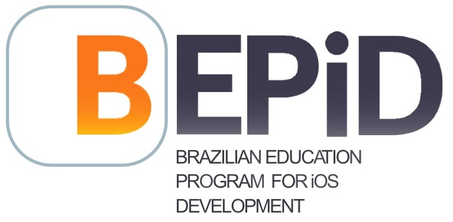

# BEPiD Studies

> Some exercises and all kind of stuff produced over a month of preparation for the *Brazilian Education Project for iOS Development(**BEPiD**)*.

> **Important Note**: One of the main goals of this repository is to bring content accessible to all, so unfortunately this one will break the *English-writing-only* rule. By now that's all the English I got for you folks.

## Tabela de Conteúdos

- [O programa]()
  - [O que é?]()
  - [Onde ocorre?]()
  - [O que oferta?]()
  - [Pré-requisitos]()
  - [Seleção]()
  - [Custo]()
  - [Certificado]()

## O programa

> Aviso: Algumas informações sobre o programa podem variar de acordo com sua cidade, consulte o site do programa de onde você mora para ter acesso a informações completas.

### O que é

Em resumo, o BEPiD é um programa de estagio remunerado para formação de desenvolvedores iOS com carga horaria de 20 horas semanais. Podem participar do programa alunos regularmente matriculados em cursos técnicos ou de graduação.

### Onde ocorre

Como pode-se conferir no [site oficial](http://www.bepid.com.br/) do programa, ele está disponível em 7 cidades brasileiras:

- [Brasília](http://www.bepiducb.com.br/)
- [Campinas](http://www.bepid.com.br/campinas/Pages/Default.aspx)
- [Fortaleza](http://www.bepid.ifce.edu.br/)
- [Manaus](http://portal.fucapi.br/bepid/)
- [Porto Alegre](http://www.bepid.com.br/poa/Pages/Default.aspx)
- [Rio de Janeiro](http://bepid.les.inf.puc-rio.br/)
- [Recife](http://bepid.cin.ufpe.br/Pages/Default.aspx)

### O que oferta

Em geral:

- Boa Infraestrutura, com laboratórios inovadores
- Professores especialistas/treinados em iOS
- Material digital (em Português)
- Auxílio Financeiro
- Kit individual de desenvolvimento iOS: MacBook, iPad e iPhone
- Certificado ao final da capacitação

### Pré-requisitos

Como dito no início da seção, estes podem variar de acordo com sua cidade, porém, em geral, não há requisitos de idade o formação, o programa destina-se a estudantes de graduação ou curso técnico, independentemente da idade. Em geral, os requisitos técnicos são:

- Paradigma de Orientação a Objetos;
- Paradigma Estruturado;
- Linguagem C
- Linguagem Java
- Fundamentos de algoritmos e estruturas de dados;
- Raciocínio Lógico: Fundamentos de lógica, análise combinatória, arranjos, permutas, etc;

### Seleção

Em geral, consiste de duas etapas:

1. Uma prova escrita e objetiva com o conteúdo da seção anterior
2. Entrevista pessoal

### Custo

Não há custo para os alunos.

### Certificado

Haverá um certificado do programa aos que concluírem o projeto com sucesso.
